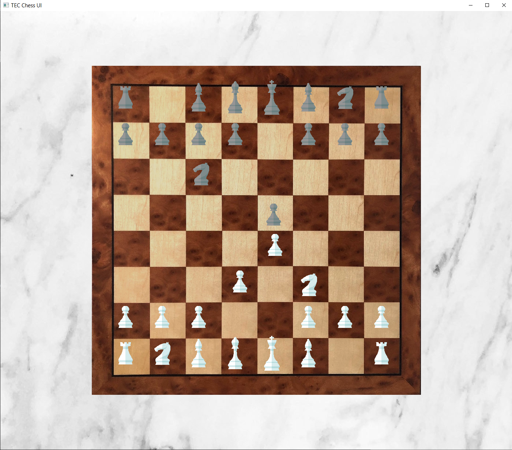

# TEC-Chess-Project
 
This repo is for developing the Engineering Club's Chess Engine and user interface.

The Integrate-Graphics and Graphics branches are for developing the Chess Board visual design and front-end usability.

Graphics are created with the abstraction library, [Simple Fast Media Library (SFML)](https://www.sfml-dev.org/index.php).

Some GUI features that remain to be completed include:

- [ ] Design/Implement a mechanism for mapping pixel positions to board coordinates
- [ ] Design/Implement a snap to coordinates mechanism as specified:
	* A released sprite will snap to the nearest (empty?) space on the board
	* Must prevent all clashing of sprite bounding boxes
- [x] Treat the Black team piece to contrast against the board more. Some options:
	* Lighten the Black Team to dark gray-ish
	* Light-colored outline around Black pieces
- [x] Implement PieceSprite movement with mouse. Options:
	* Grab and drag
	* Click to click (leaning towards this one)
- [ ] Moving piece is rendered in front of other pieces
- [x] Resizable window with view adjusted around board entity

	